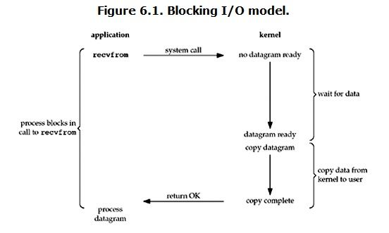
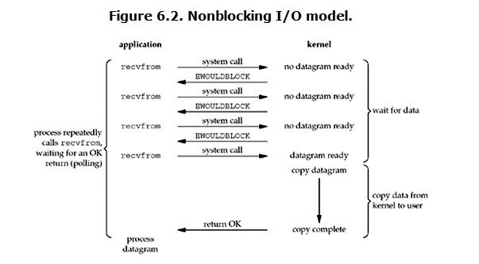
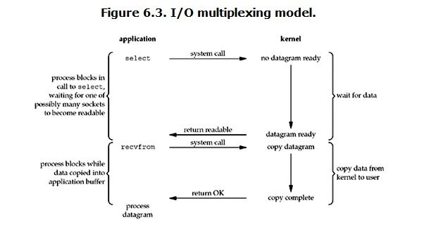
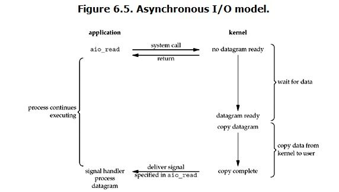

# 同步阻塞

 当在用户态调用read操作的时候，如果这时候kernel还没有准备好数据，那么用户态会一直阻塞等待，直到有数据返回。
 当kernel准备好数据之后，用户态继续等待kernel把数据从内核态拷贝到用户态之后才可以使用。
 这里会发生两种等待：一个是用户态等待kernel有数据可以读，另外一个是当有数据可读时用户态等待kernel把数据拷贝到用户态。
# 同步非阻塞

对比第一张同步阻塞IO的图就会发现，在同步非阻塞模型下第一个阶段是不等待的，无论有没有数据准备好，都是立即返回。
第二个阶段仍然是需要等待的，用户态需要等待内核态把数据拷贝过来才能使用。
对于同步非阻塞模式的处理，需要每隔一段时间就去询问一下内核数据是不是可以读了，如果内核说可以，那么就开始第二阶段等待。

# IO多路复用

IO多路复用的方式看起来跟同步阻塞是一样的，两个阶段都是阻塞的，但是IO多路复用可以实现以较小的代价同时监听多个IO。
通常情况下是通过一个线程来同时监听多个描述符，只要任何一个满足就绪条件，那么内核态就返回。IO多路复用使得传统的每请求每线程的处理方式得到解耦，
一个线程可以同时处理多个IO请求，然后交到后面的线程池里处理，这也是netty等框架的处理方式，所谓的reactor模式

# 异步IO

异步模式下，前面提到的两个阶段都不会等待。使用异步模式，用户态调用read方法的时候，相当于告诉内核数据发送给我之后告诉我一声我先去干别的事情了。
在这两个阶段都不会等待，只需要在内核态通知数据准备好之后使用即可。通常情况下使用异步模式都会使用callback，当数据可用之后执行callback函数。

# 注意
同步和异步的区别：是否需要等待结果集返回，即数据从内核拷贝到用户空间（第二阶段）是否由用户线程来完成的（即需要用户线程主动发起一次系统调用）。
阻塞和非阻塞的区别：用户态等待内核态数据准备好（第一阶段）时，用户线程是否进入waiting状态。

